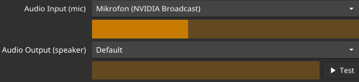
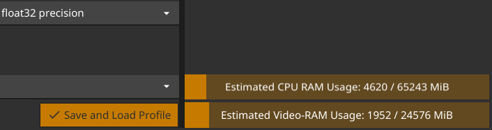
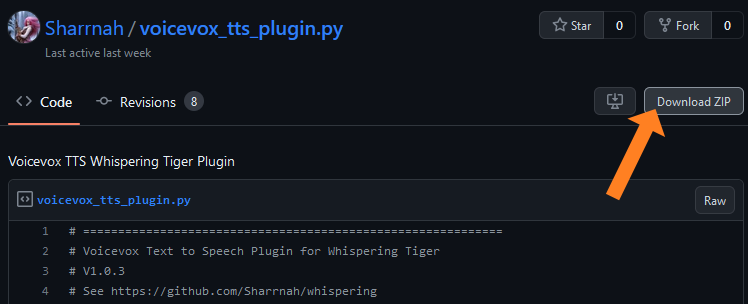
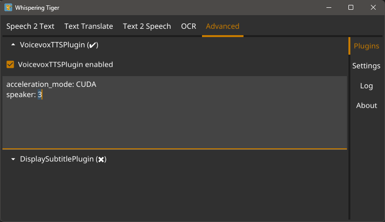

#  Whispering Tiger UI (Live Translate/Transcribe)

Whispering Tiger UI is a **Native-UI** that can be used to control the **Whispering Tiger** application.

[Whispering Tiger](https://github.com/Sharrnah/whispering) is a free and Open-Source tool that can listen/watch to any **audio stream** or **in-game image** on your machine and prints out the transcription or translation
to a web browser using Websockets or over OSC (examples are **Streaming-overlays** or **VRChat**).

## Content
- [Features](#features)
- [Download](#download)
- [Installation](#installation)
- [Setup](#setup)
  - [Plugins Setup](#plugins-setup)
  - [Specific Audio configuration (TTS to Mic, Game Audio translation, etc.)](doc/audio-config.md)
- [Advanced Features](#advanced-features)
- [Additional Help](#additional-help)
- [Screenshots](#screenshots)

## Features
- **Native-UI** for Windows (and possibly Linux in the future)
- **Easy to use** for both **beginners** and **advanced users**
- **Access to all Whispering Tiger features**, which includes:
   - Transcription / Translation of audio streams
   - Recognition and Translation of in-game images
   - Displaying the results in a web browser or VRChat, using Websockets or OSC
- **Save** and **load** configurations
- **Preview** if your selected Audio devices are working
- **Plugin** support for **additional features** (e.g. **Large Language Models**, **Emotion Prediction** or **Currently Playing Song** Plugins)
  - [Find a list of Plugins here.](https://github.com/Sharrnah/whispering/blob/main/documentation/plugins.md) 
- **Auto-Update** to the latest version of **Whispering Tiger**.

## Download
[**Download Latest Version**](https://github.com/Sharrnah/whispering-ui/releases/latest)

## Installation
1. After the download the latest version from the [**Releases**], extract it to a folder of your choice on a drive with enough free space.
2. [Install CUDA for GPU Acceleration](https://developer.nvidia.com/cuda-downloads) (Optional but recommended for NVIDIA GPUs).
3. Run the **Whispering Tiger.exe** file.
4. Let it download the latest version of **Whispering Tiger**. (It will ask to download the Platform.)
5. After the download is finished, you can create a Profile and start using the **Whispering Tiger** application.
   - On the first start, it will start downloading the A.I. Models which can take a while depending on your selected Model size. (currently it does not show the status of the model downloads)

## Setup
1. Create a Profile by entering a name and clicking on the **New** button.
2. `Websocket IP + Port` can be kept at the default values "127.0.0.1" and "5000".
   - _These are only useful if you want to run multiple instances or have the Backend Platform run on a separate PC._
   - _If you want to run multiple instances, you need to change the Port for each instance._

3. Select your Audio Input and Output devices. You can test them by speaking into your microphone and clicking on the Test button.
   - You should see the **Audio Input** bar move when you speak. and hear a test-audio and see the **Audio Output** bar move when you click on the **Test** button.
     
     
   - See also [**Audio configuration (TTS to Mic, Game Audio translation, etc.)**](doc/audio-config.md) for more information on specific Audio Setups.

4. Keep an eye on the estimated Memory consumption in the lower right corner.
   
   _It is only a rough estimate and can vary, but it should give you an idea of how much (V-)RAM you need for your selected A.I. Models. and Options._
   
   

5. Select the **A.I. Device for Speech to Text** and **Text Translation** according to your Hardware.
   - CUDA (_requires an NVIDIA GPU_) or CPU.
   - CUDA will load the A.I. into V-RAM and will be faster than CPU.

6. Select the **Speech to Text Size** and **Text Translation Size**.
   - The larger the size, the more accurate but also slower the transcription will be.
   - The larger the size, the more (V-)RAM it will use.
   - **Note:** The A.I. Model of the selected size and precision will be downloaded automatically when you start the application for the first time.

7. Select the **Speech to Text Precision** and **Text Translation Precision**
   - The higher the precision, the more accurate and the more (V-)RAM is used. (_However the accuracy differences are almost negligible_).
   - Modern GPU's have a better acceleration for `float16`.
   - CPU's only support `float32`, `int16` or `int8` precision.

> **Note:**
>  
> - You can play with the values until you get your desired results.
> - If something does not work, check the **Log** under the **Advanced** tab. And check for any error.
> - Enable **Write log to file** to save the log to a file.

### Plugins Setup
- Select your desired Plugin from the [list of Plugins here.](https://github.com/Sharrnah/whispering/blob/main/documentation/plugins.md)
- Download the `*.py` file and place it in the **Plugins** folder.
- Restart the application.
- The Plugin should now be available in the **Advanced** -> **Plugins** tab.

> **Note:**
>  
> Most Plugins have specific settings that can be configured in the textboxes of the Plugin in the **Plugins** tab.

> 

Example Setup of Japanese TTS "VoiceVox" Plugin

> 
> 1. Download the Plugin from GitHub.
>    
> 2. Place the `voicevox_tts_plugin.py` from inside the ZIP file in the **Plugins** folder.
> 3. Restart the application.
> 4. The Plugin should now be available in the **Advanced** -> **Plugins** tab.
> 5. Enable the Plugin if it is not already enabled.
> 6. Configure the Plugin to your liking. (e.g. set **speaker:** to the ID of the speaker you want to use)
>    you can find the [list of speakers and their IDs here](https://eu2.contabostorage.com/bf1a89517e2643359087e5d8219c0c67:share/voicevox-voice-ids.html).
>     
> 7. You can now use the TTS of the Plugin everywhere like the included TTS before.
>     For example in the **Text 2 Speech** Tab or enabling **Automatic Text 2 Speech**
> 

### Specific Usage Setup
- [**Audio configuration (TTS to Mic, Game Audio translation, etc.)**](doc/audio-config.md)

## Advanced Features
- [**Larger UI Scaling (VR-Mode)**](doc/advanced.md#larger-ui-scaling--vr-mode-)

## Additional Help
- For additional Help, you can join the Discord Server: [**Whispering Tiger**](https://discord.gg/V7X6xa2B2v)

## Screenshots

