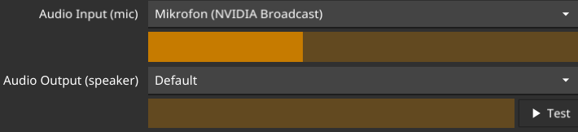
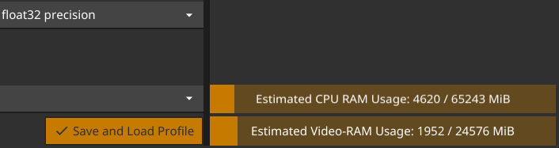

#  Whispering Tiger UI (Live Translate/Transcribe)

Whispering Tiger is a free, open-source desktop application for **Windows and Linux**. Transcribe microphone or desktop audio, translate speech and text, read text aloud, and extract text from images with OCR.

Processing runs locally after the models are downloaded. Send text to **VRChat via OSC** or to browser overlays via **WebSockets**. Online services are optional plugins.

This repository contains the native Go/Fyne UI. The [Python backend](https://github.com/Sharrnah/whispering) runs the AI models.

[Website](https://whispering-tiger.github.io/) · [Downloads](https://github.com/Sharrnah/whispering-ui/releases/latest) · [Hardware and runtimes](doc/hardware-support.md) · [Setup](#installation)

[](https://ko-fi.com/sharrnah)


## Content
- [Features](#features)
- [Download](#download)
- [Tutorials](#tutorials)
- [Installation](#installation)
  - [Windows](#windows)
  - [Linux](#linux)
- [Hardware and runtimes](doc/hardware-support.md)
- [Setup](#setup)
  - [Plugins Setup](#plugins-setup)
  - [Specific Audio configuration (TTS to Mic, Game Audio translation, etc.)](doc/audio-config.md)
  - [Realtime Configuration and speed improvements](doc/realtime-config.md)
- Documentations
  - [Integrated Text-to-Speech models](doc/documentations/integrated-tts.md)
- [Advanced Features](#advanced-features)
- [Additional Help (Discord)](#additional-help)
- [Screenshots](#screenshots)

## Features
- **Native UI for Windows and Linux**
- **Local AI processing**, usable offline after downloading the selected models
- **CPU and NVIDIA CUDA** for compatible models; **AMD, Intel and NVIDIA Vulkan** for audio.cpp STT/TTS ([runtime limits](doc/hardware-support.md))
- **Access to all Whispering Tiger features**, which includes:
   - Transcription / Translation of audio streams
   - Translation of Texts
   - Text-to-Speech
   - Recognition and Translation of in-game images
   - Displaying the results in a web browser or VRChat, using Websockets or OSC
- **Desktop audio capture** through WASAPI loopback on Windows or PulseAudio/PipeWire monitor sources on Linux
- **Audio routing** for additional sources, translation and TTS output ([audio setup](doc/audio-config.md))
- **Save** and **load** configurations
- **Preview** if your selected Audio devices are working
- **Plugin** support for **additional features** ([Find a list of Plugins here](https://github.com/Sharrnah/whispering-plugins/blob/main/README.md))
  - *Realtime Subtitles Plugin*
  - *Many Text2Speech Plugins*
  - *Emotion Prediction Plugin*
  - *Currently Playing Song Plugin*
  - *Subtitle Export Plugin*
  - *Retrieval-based Voice Conversion (RVC) Plugin*
  - *Large Language Models Plugin*
  - *and more...*
- **Auto-Update** to the latest version of **Whispering Tiger**.

## Download
[**Download Latest Version**](https://github.com/Sharrnah/whispering-ui/releases/latest) from the Releases Page.


## Tutorials
- Video Tutorial "[_Whispering Tiger - Live Translation and Transcription_](https://youtu.be/VNh6lFdQC70)":
  
  [](https://youtu.be/VNh6lFdQC70)

## Installation

Download the matching Windows or Linux ZIP from the [latest release](https://github.com/Sharrnah/whispering-ui/releases/latest). Extract it to a writable local folder with enough space for the backend and models. Do not run it from inside the ZIP.

### Windows

1. Run **Whispering Tiger.exe**.
2. Accept the backend platform download when prompted.
3. Create a profile and select your audio devices, models and compute devices.
4. Start the profile. The selected models download on first use.

For NVIDIA acceleration, follow the release's CUDA requirements. AMD and Intel users can select **audio.cpp** with **Vulkan** for STT/TTS; CUDA is not required for that path. See [hardware and runtimes](doc/hardware-support.md).

### Linux

The Linux download is for **x86-64**, with **glibc 2.36 or newer**, an OpenGL-capable X11/XWayland desktop, and PulseAudio or PipeWire's PulseAudio compatibility service.

1. Extract the Linux ZIP.
2. Open a terminal in that folder and run:

   ```sh
   chmod +x whispering-tiger-linux-amd64
   ./whispering-tiger-linux-amd64
   ```

3. Accept the Linux backend download, create a profile, and select your audio devices and models.

Run as your normal desktop user. The packaged CUDA backend includes its CUDA runtime libraries; it still needs a compatible NVIDIA driver. audio.cpp uses **CPU or Vulkan** on Linux. For desktop audio, select a monitor source through PulseAudio/PipeWire; see [audio configuration](doc/audio-config.md#linux).

## Setup
1. **Create a Profile** by entering a name and clicking on the **New** button.
2. `Websocket IP + Port` can be kept at the default values "127.0.0.1" and "5000".
   - _These are only useful if you want to run multiple instances or have the Backend Platform run on a separate PC._
   - _If you want to run multiple instances, you need to change the Port for each instance._

3. **Select your Audio Input and Output devices.** You can test them by speaking into your microphone and clicking on the Test button.
   - You should see the **Audio Input** bar move when you speak. and hear a test-audio and see the **Audio Output** bar move when you click on the **Test** button.
     
     
   - See also [**Audio configuration (TTS to Mic, Game Audio translation, etc.)**](doc/audio-config.md) for more information on specific Audio Setups.
     
     _(like when you want to translate Audio of Games, Videos or Streams that are played on your PC instead of using a Microphone as Input.)_.

4. **(Optional) use Push to Talk** Click into the field and press the keys you want to use for Push to Talk
   
   _(press each key separately to configure. When running the Profile, all keys will be required to be pressed at the same time when using Push to Talk)_

   - To disable autodetect of speech to only use Push to Talk, set `Speech volume Level` and `Speech pause detection` to 0.

5. **Keep an eye on the estimated Memory consumption** in the lower right corner.
   
   _It is only a rough estimate and can vary, but it should give you an idea of how much (V-)RAM you need for your selected A.I. Models. and Options._
   
   

6. **Select a compute device for each task.** CPU is available for compatible models. Use CUDA for supported NVIDIA models, or audio.cpp with Vulkan for AMD/Intel STT and TTS. Text translation and OCR have their own device choices; see [hardware and runtimes](doc/hardware-support.md).

7. **Select the model and size.** Larger models usually need more memory and may be slower. Language coverage and supported tasks depend on the model.

8. **Select a supported precision.** Lower precision can reduce memory use. The available choices depend on the model and runtime; a GGUF package's precision describes its stored weights. Models download automatically when needed, except options that explicitly require local weights.

> **Note:**
> <br>
> - You can play with the values until you get your desired results.
> - If something does not work, check the **Log** under the **Advanced** tab. And check for any error.
> - Enable **Write log to file** to save the log to a file.

### Plugins Setup
- Install Plugins using the UI directly, or..
- Install Plugins manually.
   - Select your desired Plugin from the [list of Plugins here.](https://github.com/Sharrnah/whispering-plugins/blob/main/README.md#list-of-plugins)
   - Download the `*.py` file and place it in the **Plugins** folder.
   - Restart the application.
   - The Plugin should now be available in the **Plugins** tab.

> **Note:**
> <br>
> Most Plugins have specific settings that can be configured in the textboxes of the Plugin in the **Plugins** tab.

### Specific Usage Setup
- [**Audio configuration (TTS to Mic, Game Audio translation, etc.)**](doc/audio-config.md)
- [**Realtime Configuration and speed improvements**](doc/realtime-config.md)

## Advanced Features
- [**Larger UI Scaling (VR-Mode)**](doc/advanced.md#larger-ui-scaling-vr-mode)
- [**Overwrite UI Language**](doc/advanced.md#overwrite-ui-language)

## Additional Help
For additional Help, you can join
- [ **Whispering Tiger on Discord**](https://discord.gg/V7X6xa2B2v)

## Screenshots


