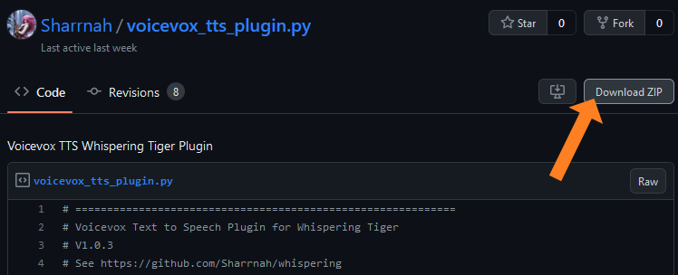

# Example Setup of Plugin VoiceVox (Japanese TTS)

1. [Download the Plugin from GitHub](https://gist.github.com/Sharrnah/7071f08d539bba6bd18e15ca40fc7c47). for example by clicking on **Download ZIP** 
   

2. Place the `voicevox_tts_plugin.py` from inside the ZIP file in the **Plugins** folder.

3. Restart the application.

4. The Plugin should now be available in the **Advanced** -> **Plugins** tab.

5. Enable the Plugin if it is not already enabled.

6. Configure the Plugin to your liking. (e.g. set **speaker:** to the ID of the speaker you want to use) 
   you can find the [list of speakers and their IDs here](https://eu2.contabostorage.com/bf1a89517e2643359087e5d8219c0c67:share/voicevox-voice-ids.html).
    

7. You can now use the TTS of the Plugin everywhere like the included TTS before.
    For example in the **Text 2 Speech** Tab or enabling **Automatic Text 2 Speech**
